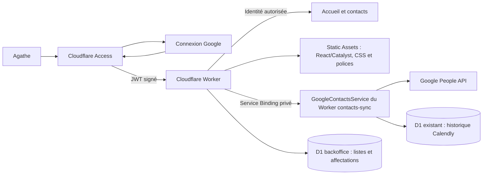

# Backoffice Cloudflare — première mise en service

## Périmètre

Le backoffice est une application indépendante dans `apps/backoffice`.
Son interface, son API et ses ressources statiques sont servies par Cloudflare
Workers ; Cloudflare Access gère la connexion Google et les cookies de session.
Le domaine retenu est **backoffice.osteopathie-animale-bordeaux.fr**.

Le site public Astro et le service Calendly → Google Contacts gardent leurs
déploiements indépendants. Le backoffice consulte tous les contacts Google,
permet de modifier leurs coordonnées et gère des listes de diffusion dans une
base D1 dédiée. Les coordonnées ne sont pas copiées dans cette nouvelle base.
La livraison du code ne déploie aucun service et ne lit aucun contact réel.



L’unique adresse autorisée est `agathe.lescout.osteo@gmail.com`. Elle n’est pas
modifiable par une variable d’environnement. L’application refuse les autres
adresses, les alias, les jetons non signés, expirés, issus d’une autre application
ou d’une autre organisation Access. Elle ne fait confiance ni à un simple en-tête
d’e-mail, ni à un cookie fourni directement au Worker.

## 1. Configurer Zero Trust et Google

Dans le compte Cloudflare du domaine, ouvrir Zero Trust et définir le nom
d’organisation. Le domaine obtenu est de la forme
`https://<equipe>.cloudflareaccess.com`.

Dans Google Cloud, créer un client OAuth **Application Web** dédié au SSO.
Il peut utiliser le même projet Google Cloud que la synchronisation existante,
mais le client OAuth de type Application de bureau utilisé par celle-ci ne
remplace pas ce client Web. Le compte d’Agathe étant un Gmail personnel,
choisir une audience **Externe**. Si l’application Google reste en mode test,
ajouter l’adresse d’Agathe aux utilisateurs de test.

Configurer :

- Origine JavaScript : `https://<equipe>.cloudflareaccess.com`.
- URI de redirection : `https://<equipe>.cloudflareaccess.com/cdn-cgi/access/callback`.

Dans **Zero Trust → Integrations → Identity providers**, ajouter le fournisseur
**Google** et y saisir le Client ID et le Client Secret. Conserver ces valeurs
dans les consoles et gestionnaires de secrets ; ne pas les ajouter au dépôt
ou les transmettre dans une conversation. Activer PKCE lorsque proposé.
Noter l’identifiant du fournisseur Google (`GOOGLE_IDP_ID`).

Le SSO sert uniquement à identifier Agathe. Il ne donne pas au Worker un jeton
Google People API et ne demande pas l’autorisation d’accéder aux contacts.

Référence : [Google avec Cloudflare Access](https://developers.cloudflare.com/cloudflare-one/integrations/identity-providers/google/).

## 2. Créer l’application Access avant la publication

Dans **Zero Trust → Access controls → Applications**, créer une application
**Self-hosted** :

- Nom : `Backoffice Agathe Lescout`.
- Domaine : `backoffice.osteopathie-animale-bordeaux.fr`.
- Aucun chemin : protéger le domaine entier, y compris `/api/*` et `/assets/*`.
- Durée de session : **8 heures**.
- Fournisseurs autorisés : **uniquement le fournisseur Google créé ci-dessus**.
- Désactiver l’acceptation de tous les fournisseurs ; ne pas autoriser le code
  par e-mail (One-time PIN), WARP ou une connexion par service token.

Créer **une seule politique** pour cette application :

| Réglage                 | Valeur                            |
| ----------------------- | --------------------------------- |
| Action                  | Allow                             |
| Include → Emails        | `agathe.lescout.osteo@gmail.com`  |
| Require → Login Methods | Le fournisseur Google sélectionné |

Il ne faut pas placer le fournisseur Google dans un deuxième `Include` : les
conditions `Include` sont alternatives, alors que `Require` s’ajoute à la
restriction d’e-mail. Ne créer aucune politique Bypass ou Service Auth.

Relever le domaine d’organisation (`ACCESS_TEAM_DOMAIN`), l’identifiant de
l’application (`ACCESS_APPLICATION_ID`) et son Audience tag (`ACCESS_AUD`).
L’audience est propre à cette application, pas au service de synchronisation.
Pour staging, créer une application distincte sur
`backoffice-staging.osteopathie-animale-bordeaux.fr`, avec les mêmes restrictions
d’identité et une audience distincte.

Références : [politiques Access](https://developers.cloudflare.com/cloudflare-one/access-controls/policies/),
[validation des JWT](https://developers.cloudflare.com/cloudflare-one/access-controls/applications/http-apps/authorization-cookie/validating-json/).

## 3. Préparer la configuration de déploiement

Créer une base D1 distincte pour chaque environnement, depuis `apps/backoffice` :

```sh
yarn wrangler d1 create osteo-backoffice-staging
yarn wrangler d1 create osteo-backoffice
```

Conserver les identifiants dans les variables de l’environnement correspondant.
Ne pas réutiliser la base de synchronisation pour les listes du backoffice.

Utiliser Node et Yarn conformément au README du monorepo. Les scripts lisent les
variables ci-dessous depuis l’environnement de la commande ou le gestionnaire
de secrets, sans en imprimer les valeurs.

| Variable                    | Usage                                                         |
| --------------------------- | ------------------------------------------------------------- |
| `CLOUDFLARE_ACCOUNT_ID`     | Compte Cloudflare du domaine et de l’application Access       |
| `BACKOFFICE_HOSTNAME`       | `backoffice.osteopathie-animale-bordeaux.fr` en production    |
| `ACCESS_TEAM_DOMAIN`        | `https://<equipe>.cloudflareaccess.com`, sans slash final     |
| `ACCESS_AUD`                | Audience tag de l’application Access correspondante           |
| `ACCESS_APPLICATION_ID`     | Identifiant de cette application Access                       |
| `GOOGLE_IDP_ID`             | Identifiant du fournisseur Google dans ce compte              |
| `CLOUDFLARE_API_TOKEN`      | Jeton privé de lecture Access et de déploiement Workers       |
| `BACKOFFICE_D1_ID`          | Identifiant de la base D1 dédiée à cet environnement          |
| `CONTACTS_SYNC_WORKER_NAME` | Optionnel : nom du Worker fournissant `GoogleContactsService` |

Le jeton doit pouvoir lire l’organisation Access, ses applications, politiques
et fournisseurs d’identité, déployer les Workers et leurs assets, appliquer
les migrations de cette base D1 et gérer le Custom Domain dans la zone concernée. Il doit être limité au compte et à la
zone nécessaires. Aucun secret Google SSO n’est requis par le Worker : il reste
dans la configuration du fournisseur d’identité Cloudflare.

Depuis `apps/backoffice` :

```sh
yarn configure production
yarn access:check production
```

`configure` écrit un `wrangler.local.json` ignoré par Git. Il configure le compte,
le domaine personnalisé, D1, le Service Binding et les paramètres Access, sans publier ni modifier
Cloudflare. Le script `access:check` ne fait que lire les API Cloudflare : il
vérifie le compte, l’organisation, l’audience, Google uniquement, l’adresse
d’Agathe, les politiques et la protection de toutes les ressources. Une règle
plus large bloque la mise en service ; les réponses privées des API ne sont
jamais imprimées.

Le domaine doit appartenir à une zone active du même compte Cloudflare.
Wrangler crée le routage du Custom Domain lors de la publication. Les routes
publiques alternatives `workers.dev` et les preview URLs restent désactivées.

## 4. Valider puis publier

Depuis la racine :

```sh
yarn workspace @osteo/backoffice run check
yarn workspace @osteo/backoffice test
yarn build:backoffice
yarn workspace @osteo/contacts-sync run check
yarn workspace @osteo/contacts-sync test
yarn build:sync
```

Après la configuration Access et ces contrôles, depuis `apps/backoffice` :

```sh
yarn access:check production
yarn wrangler d1 migrations apply DB --remote --config wrangler.local.json --env production
yarn wrangler deploy --config wrangler.local.json --env production
```

Le workflow manuel **Deploy Backoffice** reproduit cette séquence. Configurer
les variables du tableau dans l’environnement GitHub `backoffice-production`
(ou `backoffice-staging`) et le jeton comme secret. Il ne configure pas Google
OAuth à la place de l’opérateur et n’élargit pas les politiques Access.

La publication n’est pas une validation du SSO réel. Vérifier dans le navigateur :

1. Sans session, l’adresse du backoffice passe par la connexion Google.
2. Le compte d’Agathe ouvre l’accueil et `/api/session` retourne son identité.
3. Un autre compte Google est refusé, y compris sur les API et les assets.
4. La déconnexion termine la session Access. Elle ne déconnecte pas Google
   dans les autres applications ; une nouvelle visite repasse par Access.
5. Aucun contenu privé ne s’ouvre via `workers.dev` ou une URL de preview.

Les tests locaux utilisent des clés éphémères et des réponses Cloudflare
fictives. Ils vérifient la cryptographie, les règles d’accès, les erreurs,
les routes et la confidentialité des réponses. Ils ne prouvent pas les réglages
OAuth, les droits du compte Cloudflare ou la connexion Google réelle.

## 5. Brancher l’onglet Contacts

Le Worker `apps/contacts-sync` exporte désormais le point d’entrée nommé
`GoogleContactsService`, depuis `src/worker.ts`. Il est accessible uniquement
par un **Service Binding** Cloudflare sélectionnant ce point d’entrée. Le
handler HTTP public conserve ses seules routes existantes : aucun endpoint
public de consultation ou de modification des contacts n’est ajouté.

Mettre à jour ce Worker avant de publier le backoffice, en suivant les règles
de mise à jour du [guide de synchronisation](calendly-google-contacts.md).
Conserver le mode de synchronisation choisi ; cette intégration ne déclenche
ni import ni reprise des traitements automatiques. Les modifications de
coordonnées sont des actions manuelles explicites du backoffice, indépendantes
du mode du runner Calendly.

Le binding `GOOGLE_CONTACTS` vise `osteo-contacts-sync` en production et
`osteo-contacts-sync-staging` en staging, dans le même compte Cloudflare.
`CONTACTS_SYNC_WORKER_NAME` permet d’adapter ce nom. Vérifier qu’il vise
l’environnement prévu. Les secrets et bases de production ne doivent jamais
être utilisés dans un aperçu ou dans les tests.

L’autorisation `GOOGLE_OAUTH` reste uniquement dans les secrets du Worker de
synchronisation. L’éditeur nécessite le scope Google `contacts`, déjà utilisé
par cette application, ainsi que `openid` et `email` pour vérifier le compte.
Si l’autorisation n’existe pas, suivre le parcours OAuth du guide de
synchronisation ; le SSO Access ne remplace pas cette autorisation.
Chaque lecture ou modification vérifie l’adresse attendue, l’adresse Google
vérifiée et le `sub`. Le backoffice impose le compte d’Agathe, y compris au
service interne. Un service staging relié à un autre compte de test est donc
refusé ; les tests du backoffice utilisent des réponses fictives et une
identité Google simulée. Aucun secret Google n’est transmis au backoffice.

Les lectures utilisent les contacts enregistrés dans Google (`CONTACT`), avec
pagination complète des contacts et des libellés utilisateur. Elles excluent
les contacts supprimés, les suggestions « Autres contacts », les biographies
et les champs personnalisés. La recherche couvre noms, e-mails, téléphones et
noms d’animaux, avec filtres par libellé Google, liste de diffusion et présence
d’un e-mail. Le tri et la pagination d’affichage s’appliquent à l’ensemble des
pages chargées, sans limite silencieuse au premier millier de contacts.

Les informations Calendly viennent uniquement des réservations déjà associées
au même identifiant Google dans D1. Les noms d’animaux sont présentés ensemble.
Le dernier rendez-vous connu est la dernière réservation active passée ; les
annulations et les rendez-vous futurs ne deviennent pas ce dernier rendez-vous.
Cela ne constitue pas une confirmation de présence à la consultation. Les
contacts sans correspondance restent affichés avec ces champs non renseignés.
Une indisponibilité de l’historique est signalée sans masquer le carnet Google.

L’éditeur modifie uniquement prénom, nom, e-mails et téléphones via People API.
Il relit la fiche et exige le même `etag`, puis transmet les etags des sources
Google. Les notes, libellés Google, champs personnalisés et autres champs de
nom sont préservés. Un conflit retourne 409 et demande une actualisation,
sans forcer l’écriture. Les coordonnées historiques présentes dans Calendly
ne sont pas modifiées : le service de synchronisation peut les réajouter lors
d’un prochain traitement. La création et la suppression de fiches Google ne
font pas partie de cette version.

Les listes de diffusion sont distinctes des libellés Google. Elles disposent
d’un nom et d’une description, peuvent être renommées, archivées et restaurées.
Les affectations individuelles acceptent plusieurs listes et un statut par
liste : `pending` (accord à confirmer), `confirmed` (accord confirmé) ou
`unsubscribed` (désinscrit). Les ajouts groupés sont idempotents, commencent en
`pending` et préservent tout statut existant. Une archive conserve ses
affectations et accords, retrouvés à la restauration. Aucun e-mail n’est envoyé.

Toutes les API passent par la même authentification Access que les pages.
Les mutations exigent un `Origin` correspondant exactement au backoffice et
un corps JSON limité à 64 Kio. Les réponses sont privées et sans cache. Les
données Google sont affichées comme texte, jamais insérées comme HTML.

Après mise en service, vérifier une lecture du carnet, une édition autorisée,
la création d’une liste et une affectation, puis contrôler ces résultats dans
Google et le backoffice. Les tests locaux couvrent transport, contrôle du
compte, pagination, confidentialité, dates, conflits d’édition et opérations
D1 réelles en mémoire. Les essais navigateur utilisent des contacts fictifs ;
ils ne valident pas les autorisations des comptes réels.
