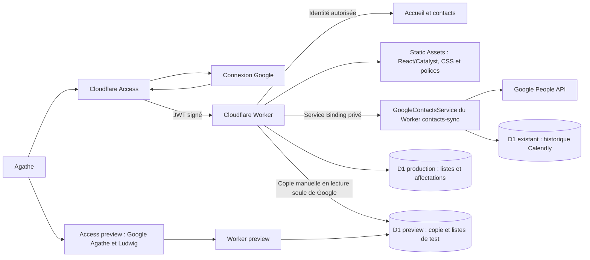

# Backoffice Cloudflare — première mise en service

## Périmètre

Le backoffice est une application indépendante dans `apps/backoffice`.
Son interface, son API et ses ressources statiques sont servies par Cloudflare
Workers ; Cloudflare Access gère la connexion Google et les cookies de session.
Le domaine retenu est **admin.osteopathie-animale-bordeaux.fr**.

Le site public Astro et le service Calendly → Google Contacts gardent leurs
déploiements indépendants. Le backoffice consulte tous les contacts Google,
permet de modifier leurs coordonnées et gère des listes de diffusion dans une
base D1 dédiée. En production, cette base contient uniquement les listes et accords.
La preview conserve une copie modifiable des coordonnées dans sa propre base D1.
La livraison du code ne déploie aucun service et ne lit aucun contact réel.



Les seules adresses autorisées sont `agathe.lescout.osteo@gmail.com` et
`vantoursludwig@gmail.com`. Cette liste n’est pas modifiable par une variable
d’environnement. Le carnet Google reste celui d’Agathe. L’application refuse les autres
adresses, les alias, les jetons non signés, expirés, issus d’une autre application
ou d’une autre organisation Access. Elle ne fait confiance ni à un simple en-tête
d’e-mail, ni à un cookie fourni directement au Worker.

## 1. Configurer Zero Trust et Google

Dans le compte Cloudflare hébergeant les Workers, ouvrir Zero Trust et définir le nom
d’organisation. Le domaine obtenu est de la forme
`https://<equipe>.cloudflareaccess.com`.

Dans Google Cloud, créer un client OAuth **Application Web** dédié au SSO.
Il peut utiliser le même projet Google Cloud que la synchronisation existante,
mais le client OAuth de type Application de bureau utilisé par celle-ci ne
remplace pas ce client Web. Le compte d’Agathe étant un Gmail personnel,
choisir une audience **Externe**. Si l’application Google reste en mode test,
ajouter l’adresse d’Agathe aux utilisateurs de test.

Configurer :

- Origine JavaScript : `https://<equipe>.cloudflareaccess.com`.
- URI de redirection : `https://<equipe>.cloudflareaccess.com/cdn-cgi/access/callback`.

Dans **Zero Trust → Integrations → Identity providers**, ajouter le fournisseur
**Google** et y saisir le Client ID et le Client Secret. Conserver ces valeurs
dans les consoles et gestionnaires de secrets ; ne pas les ajouter au dépôt
ou les transmettre dans une conversation. Activer PKCE lorsque proposé.
Noter l’identifiant du fournisseur Google (`GOOGLE_IDP_ID`).

Le SSO sert uniquement à identifier Agathe ou Ludwig. Il ne donne pas au Worker un jeton
Google People API et ne demande pas l’autorisation d’accéder aux contacts.

Référence : [Google avec Cloudflare Access](https://developers.cloudflare.com/cloudflare-one/integrations/identity-providers/google/).

## 2. Créer l’application Access avant la publication

Dans **Zero Trust → Access controls → Applications**, créer une application
**Self-hosted** :

- Nom : `Backoffice Agathe Lescout`.
- Domaine : `admin.osteopathie-animale-bordeaux.fr`.
- Aucun chemin : protéger le domaine entier, y compris `/api/*` et `/assets/*`.
- Durée de session : **8 heures**.
- Fournisseurs autorisés : **uniquement le fournisseur Google créé ci-dessus**.
- Désactiver l’acceptation de tous les fournisseurs ; ne pas autoriser le code
  par e-mail (One-time PIN), WARP ou une connexion par service token.

Créer **une seule politique** pour cette application :

| Réglage                 | Valeur                                                       |
| ----------------------- | ------------------------------------------------------------ |
| Action                  | Allow                                                        |
| Include → Emails        | `agathe.lescout.osteo@gmail.com`, `vantoursludwig@gmail.com` |
| Require → Login Methods | Le fournisseur Google sélectionné                            |

Il ne faut pas placer le fournisseur Google dans un deuxième `Include` : les
conditions `Include` sont alternatives, alors que `Require` s’ajoute à la
restriction d’e-mail. Ne créer aucune politique Bypass ou Service Auth.

Relever le domaine d’organisation (`ACCESS_TEAM_DOMAIN`), l’identifiant de
l’application (`ACCESS_APPLICATION_ID`) et son Audience tag (`ACCESS_AUD`).
L’audience est propre à cette application, pas au service de synchronisation.
Pour la preview, créer une application distincte sur
`admin-preview.osteopathie-animale-bordeaux.fr`, avec les mêmes restrictions
d’identité et une audience distincte.

Références : [politiques Access](https://developers.cloudflare.com/cloudflare-one/access-controls/policies/),
[validation des JWT](https://developers.cloudflare.com/cloudflare-one/access-controls/applications/http-apps/authorization-cookie/validating-json/).

## 3. Deux environnements isolés

|                    | Preview                                         | Production                                    |
| ------------------ | ----------------------------------------------- | --------------------------------------------- |
| Domaine            | `admin-preview.osteopathie-animale-bordeaux.fr` | `admin.osteopathie-animale-bordeaux.fr`       |
| Worker             | `osteo-backoffice-preview`                      | `osteo-backoffice`                            |
| Base principale D1 | `osteo-backoffice-preview`                      | `osteo-backoffice`                            |
| Contacts           | Copie indépendante et modifiable                | Google People API via le service privé        |
| Accès              | Google, comptes d’Agathe et Ludwig uniquement   | Google, comptes d’Agathe et Ludwig uniquement |
| Publication        | Push sur `preview`, ou lancement manuel         | Lancement manuel depuis `main`                |

La preview possède une application Access et une audience distinctes. Elle ne
possède **aucun Service Binding Google ni secret Google/Calendly**, et ses
modifications de fiches ne sont jamais synchronisées vers Gmail. Le Worker
production dispose d’un binding supplémentaire `PREVIEW_DB`, qui permet de
copier les données vers la base de preview après une action authentifiée.
Les listes et leurs accords restent propres à chaque environnement.

### Préparer Access et D1

Après les étapes Google et Zero Trust ci-dessus, renseigner dans le gestionnaire
de secrets de l’environnement d’exécution `CLOUDFLARE_API_TOKEN`, puis les valeurs
non secrètes `CLOUDFLARE_ACCOUNT_ID` et `GOOGLE_IDP_ID`. Pour Codex cloud, autoriser
`api.cloudflare.com` dans la configuration réseau de cet environnement. Ne jamais
coller le jeton ou les secrets OAuth dans le chat, un fichier suivi par Git ou
les variables publiques du front-end.

Le jeton de préparation doit pouvoir lire l’organisation et le fournisseur
Google, lire/créer les applications et politiques Access et les bases D1.
Le jeton de déploiement doit pouvoir lire Access, lire/modifier les bases D1,
publier les Workers et leurs assets, lire la zone Cloudflare et gérer ses routes Workers et domaines personnalisés. Limiter les droits au compte et à la zone concernés. Un jeton de CI n’a pas besoin de créer/modifier les politiques
Access. Le fournisseur Google et ses secrets OAuth se configurent dans Zero
Trust ; aucun de ces scripts ne crée un client OAuth Google.

Depuis `apps/backoffice` :

```sh
yarn provision preview
yarn provision production
```

Le provisionnement est réexécutable : il réutilise une application et une base
existantes si leur configuration correspond, sinon il crée les ressources
manquantes. Une politique Access trop large provoque un refus ; elle n’est pas
réécrite automatiquement. Il n’active aucun Worker ni import. Les identifiants
résultants sont enregistrés dans `.credentials/backoffice-preview.json` et
`.credentials/backoffice-production.json`, ignorés par Git et sans jeton privé.

On peut aussi créer les ressources à la main et fournir ces variables :

| Variable                | Usage                                                                     |
| ----------------------- | ------------------------------------------------------------------------- |
| `CLOUDFLARE_ACCOUNT_ID` | Compte Cloudflare commun                                                  |
| `BACKOFFICE_HOSTNAME`   | Domaine exact de l’environnement, facultatif en local                     |
| `ACCESS_TEAM_DOMAIN`    | `https://<equipe>.cloudflareaccess.com`                                   |
| `ACCESS_AUD`            | Audience de l’application Access de cet environnement                     |
| `ACCESS_APPLICATION_ID` | Identifiant de cette application                                          |
| `GOOGLE_IDP_ID`         | Fournisseur Google uniquement                                             |
| `CLOUDFLARE_API_TOKEN`  | Secret du déploiement                                                     |
| `BACKOFFICE_D1_ID`      | Base principale de cet environnement                                      |
| `PREVIEW_D1_ID`         | Production uniquement : base de preview, différente de sa base principale |

`yarn configure preview` ou `yarn configure production` prépare un
`wrangler.local.json` ignoré par Git, limité à l’environnement choisi. Les
variables explicites du processus prennent le pas sur le fichier privé issu
du provisionnement. `yarn access:check preview` (ou `production`) vérifie les
politiques Google, l’audience, le domaine et les noms réels des bases D1 avant
les migrations ou la publication. Une inversion des bases bloque le déploiement.
Les noms de Workers et domaines sont fixés dans `scripts/environments.mjs`.

## 4. Publier et travailler dans la preview

Les vérifications locales restent sans secret ni donnée réelle :

```sh
yarn workspace @osteo/backoffice run check
yarn workspace @osteo/backoffice test
yarn build:backoffice
```

Le build compile séparément les Workers preview et production en **dry-run**.
Après préparation des ressources, depuis `apps/backoffice` :

```sh
yarn deploy preview
# Après mise à jour du service Google privé (étape 5) :
yarn deploy production
```

Chaque publication prépare la configuration, contrôle Access et l’isolation D1,
compile les assets et le Worker, applique les migrations à la base principale
ciblée puis déploie le Worker sur son domaine personnalisé. Déployer la preview en premier pour que
sa base et ses tables de copie existent avant la production. Les deux bases
partagent les mêmes migrations ; les tables de copie restent vides en production.
Les deux domaines personnalisés sont protégés par Access. Les adresses `workers.dev`
et les URL de version Cloudflare (`preview_urls`) sont désactivées. Le domaine
reste enregistré chez OVH ; sa zone DNS est gérée par Cloudflare. Le site public
reste sur Netlify avec des enregistrements DNS sans proxy.

Pour GitHub Actions, créer les environnements `backoffice-preview` et
`backoffice-production`, y renseigner les variables du tableau et le jeton
comme secret. Restreindre les branches de l’environnement production à `main`
et activer une validation de déploiement si souhaité. Après fusion du workflow
sur `main`, le workflow **Deploy Backoffice** permet un lancement manuel sur
l’environnement choisi. Tout push sur la branche `preview` met à jour la
preview ; une publication production lancée depuis une autre branche que
`main` est refusée. Les PR seules ne déclenchent pas de déploiement privilégié.

Le parcours de travail est : branche de fonctionnalité → branche `preview`
pour tester → PR vers `main` → publication manuelle de la production. Promouvoir
le code ne copie ni les listes de test ni les modifications de fiches en production.
Un redéploiement conserve les données D1 et les essais en cours.

### Copier les vrais contacts pour les essais

1. Se connecter à la **production** avec le compte Google d’Agathe.
2. Ouvrir Contacts → **Copier en preview**.
3. Confirmer le remplacement, puis garder la fenêtre ouverte pendant la copie.
4. Ouvrir la preview et actualiser les contacts.

Cette action lit les contacts Google via le service privé de production et
écrit uniquement dans `PREVIEW_DB`. La copie inclut les champs affichés (noms,
e-mails, téléphones, animaux, dernier rendez-vous connu et libellés), jamais
les biographies, notes de consultation ou réponses API brutes. Elle contient
des données personnelles réelles : elle bénéficie du même accès privé que la
production et ne doit jamais être utilisée dans les tests, captures publiques,
exports HTML de démonstration ou journaux. La démo locale conserve ses données
fictives.

La copie avance par pages, reprend après une interruption et reste invisible
tant qu’elle n’est pas complète. Une seule copie peut avancer à la fois.
La version précédente reste consultable si Google est indisponible. Les anciennes
copies sont supprimées après activation de la nouvelle. Relancer une copie
remplace les coordonnées modifiées en preview ; ses listes et accords restent
conservés. Aucun renouvellement automatique ne vient écraser les essais.

La publication ne prouve pas le fonctionnement du SSO réel. Vérifier sur chaque
domaine : redirection Google sans session, admission des comptes d’Agathe et Ludwig, refus
d’un autre compte sur pages/API/assets, déconnexion, et absence d’accès alternatif
via les URL de version. Vérifier ensuite une copie et une modification en preview,
puis confirmer que la fiche Gmail source n’a pas changé.

## 5. Brancher l’onglet Contacts

Le Worker `apps/contacts-sync` exporte désormais le point d’entrée nommé
`GoogleContactsService`, depuis `src/worker.ts`. Il est accessible uniquement
par un **Service Binding** Cloudflare sélectionnant ce point d’entrée. Le
handler HTTP public conserve ses seules routes existantes : aucun endpoint
public de consultation ou de modification des contacts n’est ajouté.

Mettre à jour ce Worker avant de publier le backoffice, en suivant les règles
de mise à jour du [guide de synchronisation](calendly-google-contacts.md).
Conserver le mode de synchronisation choisi ; cette intégration ne déclenche
ni import ni reprise des traitements automatiques. Les modifications de
coordonnées sont des actions manuelles explicites du backoffice, indépendantes
du mode du runner Calendly.

Le binding `GOOGLE_CONTACTS` vise uniquement `osteo-contacts-sync` en production,
dans le même compte Cloudflare. La preview ne possède pas ce binding : elle lit
et modifie la copie D1. Aucun secret Google de production n’est fourni à la
preview, et les tests utilisent exclusivement des données fictives.

L’autorisation `GOOGLE_OAUTH` reste uniquement dans les secrets du Worker de
synchronisation. L’éditeur nécessite le scope Google `contacts`, déjà utilisé
par cette application, ainsi que `openid` et `email` pour vérifier le compte.
Si l’autorisation n’existe pas, suivre le parcours OAuth du guide de
synchronisation ; le SSO Access ne remplace pas cette autorisation.
Chaque lecture ou modification vérifie l’adresse attendue, l’adresse Google
vérifiée et le `sub`. Le backoffice autorise Agathe et Ludwig, et impose le carnet d’Agathe au
service interne. Les tests du backoffice utilisent des réponses fictives et une
identité Google simulée. Aucun secret Google n’est transmis au backoffice.

Les lectures utilisent les contacts enregistrés dans Google (`CONTACT`), avec
pagination complète des contacts et des libellés utilisateur. Elles excluent
les contacts supprimés, les suggestions « Autres contacts », les biographies
et les champs personnalisés. La recherche couvre noms, e-mails, téléphones et
noms d’animaux, avec filtres par libellé Google, liste de diffusion et présence
d’un e-mail. Le tri et la pagination d’affichage s’appliquent à l’ensemble des
pages chargées, sans limite silencieuse au premier millier de contacts.

Les informations Calendly viennent uniquement des réservations déjà associées
au même identifiant Google dans D1. Les noms d’animaux sont présentés ensemble.
Le dernier rendez-vous connu est la dernière réservation active passée ; les
annulations et les rendez-vous futurs ne deviennent pas ce dernier rendez-vous.
Cela ne constitue pas une confirmation de présence à la consultation. Les
contacts sans correspondance restent affichés avec ces champs non renseignés.
Une indisponibilité de l’historique est signalée sans masquer le carnet Google.

L’éditeur modifie uniquement prénom, nom, e-mails et téléphones via People API.
Il relit la fiche et exige le même `etag`, puis transmet les etags des sources
Google. Les notes, libellés Google, champs personnalisés et autres champs de
nom sont préservés. Un conflit retourne 409 et demande une actualisation,
sans forcer l’écriture. Les coordonnées historiques présentes dans Calendly
ne sont pas modifiées : le service de synchronisation peut les réajouter lors
d’un prochain traitement. La création et la suppression de fiches Google ne
font pas partie de cette version.

Les listes de diffusion sont distinctes des libellés Google. Elles disposent
d’un nom et d’une description, peuvent être renommées, archivées et restaurées.
Les affectations individuelles acceptent plusieurs listes et un statut par
liste : `pending` (accord à confirmer), `confirmed` (accord confirmé) ou
`unsubscribed` (désinscrit). Les ajouts groupés sont idempotents, commencent en
`pending` et préservent tout statut existant. Une archive conserve ses
affectations et accords, retrouvés à la restauration. Aucun e-mail n’est envoyé.

Toutes les API passent par la même authentification Access que les pages.
Les mutations exigent un `Origin` correspondant exactement au backoffice et
un corps JSON limité à 64 Kio. Les réponses sont privées et sans cache. Les
données Google sont affichées comme texte, jamais insérées comme HTML.

Après mise en service, vérifier une lecture du carnet, une édition autorisée,
la création d’une liste et une affectation, puis contrôler ces résultats dans
Google et le backoffice. Les tests locaux couvrent transport, contrôle du
compte, pagination, confidentialité, dates, conflits d’édition et opérations
D1 réelles en mémoire. Les essais navigateur utilisent des contacts fictifs ;
ils ne valident pas les autorisations des comptes réels.
