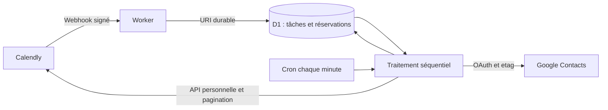

# Calendly → Google Contacts : installation et exploitation

## Livraison et périmètre

Deux changements successifs : migration du site dans `apps/website`, puis service dans `apps/contacts-sync`. Les deux déploiements sont indépendants. Ce guide décrit les opérations à réaliser après validation du code ; la livraison du dépôt ne configure aucun compte et n’importe aucun contact réel.

Un utilisateur Calendly vers un compte Gmail personnel, dont l’adresse est définie dans la configuration privée. Le parcours utilise le filtre `user` seul pour ne pas exiger le rôle administrateur ; Calendly peut ainsi retourner les événements personnels des organisations actuelles ou passées encore accessibles. Les événements collectifs ne sont importés que si cet utilisateur figure parmi leurs hôtes. Pas de synchronisation des autres membres de l’organisation, ni de fusion automatique entre plusieurs adresses e-mail. Un contact Google existant partagé par plusieurs adresses de réservation provoque un conflit à examiner.

Les droits API et webhook du forfait Calendly réel doivent être confirmés à l’installation. Le code ne déduit aucun droit de la présence d’un menu. Un refus de création d’abonnement reste un refus : ne pas souscrire automatiquement à une offre. L’import ne peut récupérer que les événements et invités encore conservés et visibles par l’API. Il n’impose pas de date de début ni de filtre de statut et ne promet pas une profondeur d’historique que Calendly ne fournit plus.

## Architecture et règles de données



- `POST /webhooks/calendly` accepte `invitee.created` et `invitee.canceled`. HMAC SHA-256 du corps brut, horodatage à ±3 minutes, comparaison cryptographique, corps limité à 256 Kio. La réponse 202 arrive après l’enregistrement D1 ; un échec D1 retourne 503. Le contenu invité du webhook n’est pas conservé : l’API est relue pour obtenir l’état actuel.
- Une invocation cron exécute au plus 30 unités de travail et cesse d’en démarrer après 50 secondes ou avant épuisement du budget de 45 requêtes HTTP externes. Chaque unité traite une page d’import de 100 événements, une page de 5 invités, une page de 1 000 contacts Google ou un contact. Les parcours et tâches alternent pour progresser sans monopoliser les nouvelles notifications. L’authentification est réutilisée uniquement pendant le lot ; les deux lectures indépendantes d’un événement Calendly sont parallélisées. Les lectures et mises à jour de suivi D1 sont regroupées pour limiter les allers-retours. Les écritures Google restent séquentielles ; un bail D1 de 120 secondes protège tout le lot. Les écritures s’arrêtent après 50 secondes et revérifient le bail et le mode avant chaque mutation.
- La réconciliation repart 24 heures après la fin du parcours précédent, relit tous les événements personnels et leurs invités, et reprend chaque pagination en D1. Elle récupère aussi les changements d’invités qui n’ont pas changé l’événement. L’import d’un historique important peut prendre plusieurs heures ou jours : suivre le retard, ne pas lancer plusieurs runners en parallèle.
- L’e-mail est normalisé par suppression des espaces autour et passage en minuscules. Les points et suffixes `+` sont conservés. Pour les contacts sans identifiant Google connu, un index paginé est rafraîchi avant rapprochement (au plus 5 minutes d’ancienneté, et obligatoirement après une création incertaine). Après un premier inventaire complet, un `syncToken` permet de ne récupérer que les modifications et suppressions. Le curseur, les paramètres et le jeton sont repris de manière cohérente ; un jeton expiré provoque un nouvel inventaire complet. Un contact déjà associé est relu directement par son identifiant sans attendre l’index. Une correspondance multiple bloque le contact. Les index Google peuvent avoir un délai de propagation ; la reprise d’une création incertaine reste bloquée tant que son marqueur n’est pas retrouvé.
- Les noms existants sont préservés. Le service renseigne un nom absent, ajoute l’e-mail s’il manque, ajoute les téléphones distincts, conserve les autres numéros, champs personnalisés et libellés, et ajoute **Calendly**. Le contact est relu et ses etags sont envoyés avec chaque mise à jour.
- Les réservations restent séparées par URI d’invité Calendly. Deux animaux portant le même prénom ne sont jamais fusionnés. Les URI `old_invitee` / `new_invitee` relient les reports. Une annulation garde le contact et modifie le statut de la réservation.
- Les notes automatiques sont délimitées par `--- Calendly (synchronisation) ---` et `--- Fin Calendly ---`. Le texte avant et après est conservé. Le bloc courant doit correspondre au dernier bloc confirmé ou à la dernière écriture en attente. Modification manuelle, suppression du bloc ou dépassement de **16 000 octets UTF-8** pour les notes complètes : conflit, sans troncature. Ce seuil est un choix prudent du service, pas une limite Calendly annoncée.
- Un marqueur UUID `calendly_sync_id` est enregistré dans les champs personnalisés Google et D1. Après une création au résultat incertain, le service recherche ce marqueur ; il ne refait jamais aveuglément un POST. L’index Google peut avoir un délai de propagation : une absence reste un conflit à réexaminer.
- Les erreurs temporaires sont reprises avec attente progressive, prise en compte de `Retry-After` et au plus huit tentatives par tâche avant conflit. Les erreurs d’infrastructure (index, parcours) suspendent les nouvelles tentatives au moins une minute ; une configuration ou autorisation invalide au moins une heure. Les tâches ne sont pas supprimées. Si un contrôle de pause ou de délai bloque une écriture avant tout appel Google, la tentative préparée est restaurée à son état précédent ; elle ne devient pas une création incertaine ni un faux conflit de notes.

D1 contient des données personnelles nécessaires au service (e-mails, coordonnées, réponses sélectionnées, références, états). Limiter ses accès aux administrateurs concernés et prévoir leur suppression lors de l’arrêt du service. Les journaux applicatifs ne contiennent ni coordonnées, ni réponses, ni jetons. Les logs Worker persistants sont désactivés. Ne pas activer une capture des corps ou des en-têtes dans les outils externes.

## Champs Calendly

Le nom et l’e-mail viennent des champs standards. `src/model.ts` mappe les questions suivantes, indépendamment de la casse, des accents, des espaces périphériques et du type d’apostrophe :

| Destination | Question                      |
| ----------- | ----------------------------- |
| Téléphone   | Numéro de téléphone           |
| Animal      | Prénom de l’animal            |
| Espèce      | Espèce de l’animal            |
| Race        | Race de l’animal              |
| Naissance   | Date de naissance de l’animal |
| Motif       | Motif de consultation         |

Ces libellés sont des valeurs de configuration dans le code, **pas le résultat d’un nouvel audit du compte**. Vérifier les noms des questions des types d’événements actifs, adapter `bookingFrom` et ses tests si nécessaire. Une question différente n’est pas importée automatiquement. Les autres réponses ne sont pas conservées.

## 1. Préparer Cloudflare

Depuis la racine, installer avec Node `.nvmrc` et `yarn install --frozen-lockfile`, puis :

```sh
cd apps/contacts-sync
yarn wrangler login
yarn wrangler d1 create osteo-contacts-sync-staging
yarn wrangler d1 create osteo-contacts-sync
```

Staging doit utiliser un compte Google de test et un utilisateur Calendly de test. Ne jamais y mettre les identifiants de production. Conserver les identifiants des bases et du compte Cloudflare dans un gestionnaire approprié.

Renseigner les variables d’environnement locales `CLOUDFLARE_ACCOUNT_ID`, `CONTACTS_SYNC_D1_ID`, `EXPECTED_GOOGLE_EMAIL`, `CALENDLY_USER_URI`, `CALENDLY_ORGANIZATION_URI`, puis générer la configuration de l’environnement choisi :

```sh
node scripts/configure.mjs staging
# Avec les valeurs distinctes de production :
node scripts/configure.mjs production
```

Le fichier `wrangler.local.json` est ignoré par Git et conserve l’autre environnement lorsqu’on en configure un. On peut aussi copier `wrangler.jsonc` vers ce fichier et renseigner les valeurs dans un éditeur. Les URI Calendly se récupèrent par `/users/me` via un outil API privé ; ne pas copier la réponse dans une PR ou un journal partagé.

Déployer d’abord le Worker en pause, sans secret :

```sh
yarn wrangler d1 migrations apply DB --remote --config wrangler.local.json --env staging
yarn wrangler deploy --config wrangler.local.json --env staging
```

Répéter pour `production` uniquement après les essais staging. L’endpoint `/health` indique seulement que le Worker répond, pas que les API ou les autorisations sont opérationnelles. Un déploiement ultérieur conserve le mode D1 existant : exécuter `admin pause` avant une intervention si nécessaire.

## 2. Autoriser Google

Dans Google Cloud, créer un projet dédié, activer **People API**, configurer OAuth **Externe**, ajouter le scope `https://www.googleapis.com/auth/contacts` ainsi que `openid` et `email`, et publier l’écran de consentement **En production**. Créer un client **Application de bureau** et télécharger son fichier JSON dans un emplacement privé hors Git.

Le mode Test peut expirer le refresh token après sept jours pour ces scopes. Le passage en production ne garantit pas une autorisation éternelle : révocation, politique de compte ou expiration nécessitent une reconnexion. Pour une application personnelle, vérifier les exceptions de validation OAuth et accepter l’éventuel avertissement d’application non vérifiée uniquement pour ce propre projet. Ne pas publier une application multi-utilisateur sans vérifier les obligations de validation.

```sh
yarn authorize --env staging --credentials /chemin/prive/client-oauth.json
```

L’assistant ouvre le navigateur, utilise PKCE et un callback loopback avec `state`, vérifie l’adresse destinataire et le `sub`, puis envoie directement `GOOGLE_OAUTH` à Wrangler via stdin. Aucun jeton n’est affiché ni écrit dans le dépôt. Pour la production, reprendre avec son client/projet et le compte Gmail destinataire convenu, dont l’adresse exacte doit être renseignée dans `EXPECTED_GOOGLE_EMAIL`.

## 3. Activer la réception Calendly avant l’import

Créer manuellement un jeton personnel disposant des lectures d’événements, invités et utilisateur, ainsi que de la gestion des abonnements webhook requise. Le garder dans un gestionnaire de secrets. Le helper ne crée pas de jeton ni d’abonnement payant.

Depuis un terminal zsh, saisir le jeton de façon masquée ; l’expansion transmise sur stdin ne s’inscrit pas dans la commande enregistrée par l’historique. Désactiver toute trace shell (`set -x`) avant cette opération.

```sh
read -rs 'calendly_pat?Jeton Calendly : '
print -rn -- "$calendly_pat" | yarn subscribe --env staging --url https://VOTRE-WORKER.workers.dev/webhooks/calendly --confirm-subscription
unset calendly_pat
```

Le helper vérifie l’utilisateur et l’organisation, refuse un abonnement préexistant pour le même endpoint, génère une clé de signature et enregistre `CALENDLY_TOKEN` / `CALENDLY_SIGNING_KEY` directement dans les secrets Cloudflare. Il crée un abonnement **scope user** pour les deux événements. Si la réponse de création est perdue, vérifier l’abonnement dans un outil privé avant de recommencer : ne pas remplacer une clé utilisée par un abonnement existant.

Le webhook doit rester public pour Calendly ; toutes les commandes d’administration passent par les droits Cloudflare, sans route HTTP d’administration. Si les webhooks sont indisponibles pour le forfait, le parcours API quotidien fonctionne seul avec `CALENDLY_TOKEN` configuré par `wrangler secret put`, mais n’offre pas la même fraîcheur. Confirmer ce choix avant la mise en service.

## 4. Simulation, pilote, import et suivi

Les exemples ci-dessous s’exécutent depuis `apps/contacts-sync`. `--env production` sélectionne le fichier privé et la base distante. Depuis la racine, l’équivalent est `yarn sync:admin …`.

```sh
yarn admin status --env production
yarn admin simulate --env production
yarn admin import --env production
yarn admin status --env production
```

La simulation lit Calendly et Google et écrit uniquement dans D1. Elle prédit `would_create` / `would_update`, construit les réservations et signale les conflits. Attendre la fin du parcours (`scan_active=0`) et des tâches en attente avant de valider ; examiner les nombres et conflits dans `status`. Ne pas recopier les données réelles dans les outils de développement.

```sh
yarn admin pilot --env production --confirm-google-writes
yarn admin status --env production
```

Le pilote autorise au plus cinq contacts distincts ; le compteur réserve aussi les contacts dont une tentative échoue. Les suivants restent en attente avec `pilot_limit`. Contrôler dans Google Contacts : nom conservé, téléphones, libellés, notes manuelles, plusieurs animaux et annulations. Le passage en pilote remet les tâches contacts terminées en attente ; les conflits demandent une reprise explicite.

```sh
yarn admin live --env production --confirm-google-writes
yarn admin status --env production
```

Le passage en live libère la limite du pilote, termine l’import reprenable et garde webhooks + réconciliation actifs. Contrôler après 24 h le dernier succès, `lag_ms`, les conflits, `needs_reconnection`, les doublons visuellement et les quotas dans les consoles Google et Cloudflare. Ce contrôle est une étape opérateur, pas une automatisation Codex installée par le dépôt.

## Commandes et incidents

| Commande                  | Effet                                                                                                                                    |
| ------------------------- | ---------------------------------------------------------------------------------------------------------------------------------------- |
| `status`                  | Mode, dernier succès/erreur, retard en millisecondes, compteurs, reconnexion et identifiants numériques des conflits ; aucune coordonnée |
| `pause`                   | Arrête les traitements ; les webhooks restent durablement enregistrés. Une requête Google déjà partie peut finir.                        |
| `simulate`                | Rejoue les contacts sans écriture Google ; les conflits restent bloqués                                                                  |
| `pilot`, `live`           | Écritures Google avec `--confirm-google-writes` explicite                                                                                |
| `import`, `reconcile-all` | Redémarre un parcours complet sans effacer les contacts ni réservations déjà importés                                                    |
| `refresh-index`           | Force un nouvel inventaire Google avant le prochain contact                                                                              |
| `retry ID`                | Reprend une tâche après résolution de sa cause ; ne contourne aucune protection                                                          |

Pour une autorisation révoquée : mettre en pause, relancer `authorize`, reprendre en simulation et vérifier avant live. Pour une erreur Calendly d’accès : vérifier jeton, rôle et forfait, sans souscrire automatiquement.

Pour `duplicate_google_contacts`, `google_contact_shared_by_emails` ou `contact_marker_conflict`, résoudre manuellement le rapprochement avec le propriétaire des données. Le service ne fusionne rien. Pour `google_contact_deleted`, une suppression Google n’entraîne jamais de recréation ; restaurer le contact seulement si l’utilisateur le souhaite. Pour `creation_uncertain`, attendre la propagation Google, `refresh-index`, puis `retry ID` : un marqueur retrouvé permet la reprise ; une absence reste bloquante et requiert une investigation, jamais une remise à zéro aveugle du marqueur D1.

Pour `notes_manually_modified`, préserver d’abord les modifications personnelles dans une partie hors du bloc puis rétablir le bloc automatique précédent avec un administrateur disposant d’un accès privé à D1. Pour `notes_too_large`, revoir explicitement la stratégie de notes avec le développeur ; aucune suppression d’historique n’est exécutée par le service. Ne jamais forcer une réécriture via SQL sans sauvegarde et validation du contenu. Pour un libellé Calendly supprimé manuellement, vérifier les libellés et réinitialiser `settings.google_group` via un accès D1 privé avant la reprise.

## CI, déploiement et limites de validation

`yarn run check`, `yarn test`, `yarn build` et `yarn build:sync` valident les deux workspaces. `yarn test:e2e` couvre le site. Les tests Worker utilisent SQLite en mémoire avec les requêtes réelles et des API injectées fictives. Ils couvrent signature, persistance, doublons, notes, annulations, reports, pagination, conflits et reprises. Ils ne prouvent pas les permissions des comptes réels, les quotas de production ou le succès du consentement OAuth dans le navigateur.

La PR du service est empilée sur la migration. Les contrôles de code et Playwright tournent sur les deux ; Lighthouse Netlify s’exécute pour les PR vers `main`, qui reçoit les Deploy Previews. Après fusion de la migration, cibler `main` et attendre ce contrôle sur le nouveau commit avant de fusionner le service. Le changement de base relance la CI. [Conditions des Deploy Previews Netlify](https://docs.netlify.com/deploy/deploy-types/deploy-previews/).

Le workflow `Contacts Sync` compile le Worker et applique les migrations **locales** sans secret. `Deploy Contacts Sync` se déclenche manuellement, applique D1 et déploie l’environnement choisi. Configurer les environnements GitHub `contacts-sync-staging` et `contacts-sync-production`, un secret `CLOUDFLARE_API_TOKEN` limité aux ressources requises et les cinq variables de configuration listées plus haut. Mettre les secrets Calendly et Google uniquement dans Cloudflare. Protéger l’environnement de production selon les droits disponibles sur le dépôt.

Avant mise en service, réaliser réellement : consentement Google, abonnement Calendly, simulation, pilote, contrôle manuel, puis contrôle à 24 h. Vérifier les noms de champs et la profondeur d’historique accessibles. Ne pas considérer les mocks comme une validation de ces étapes.

## Coûts et références

Aucun Make, Zapier, serveur permanent ou orchestrateur de monorepo. Démarrer avec Workers Free et D1 Free ; leur suffisance dépend notamment du CPU, du nombre d’opérations, du stockage et de la taille de l’historique. Aucun changement de forfait n’est effectué par le code. Vérifier les quotas Google et les droits du forfait Calendly actuel au moment de l’installation.

- [Tarifs et limites Workers](https://developers.cloudflare.com/workers/platform/pricing/), [tarifs D1](https://developers.cloudflare.com/d1/platform/pricing/) et [batch D1 atomique](https://developers.cloudflare.com/d1/worker-api/d1-database/).
- [Historique et périmètre personnel Calendly](https://developer.calendly.com/api-docs/calendly-api/scheduled-events/list-scheduled-events), [abonnement webhook Calendly](https://developer.calendly.com/api-docs/calendly-api/webhooks/create-webhook-subscription) et [signatures](https://developer.calendly.com/api-docs/overview/webhooks/webhook-signatures).
- [People API : inventaire des contacts et propagation](https://developers.google.com/people/api/rest/v1/people.connections/list), [mise à jour, etags et écritures séquentielles](https://developers.google.com/people/api/rest/v1/people/updateContact).
- [OAuth applications natives et PKCE](https://developers.google.com/identity/protocols/oauth2/native-app), [expiration des refresh tokens](https://developers.google.com/identity/protocols/oauth2), [validation des scopes sensibles et exceptions personnelles](https://developers.google.com/identity/protocols/oauth2/production-readiness/sensitive-scope-verification).
- [Yarn 1 Workspaces](https://classic.yarnpkg.com/lang/en/docs/workspaces/) et [monorepos Netlify](https://docs.netlify.com/build/configure-builds/monorepos/).

## Mise à jour du traitement par lots

La migration `0002_incremental_index.sql` ajoute le jeton de synchronisation Google et réinitialise uniquement le curseur de l’ancien inventaire (la taille de page change). Elle conserve les réservations, correspondances, tâches et conflits. Pour un service déjà actif : noter le mode, mettre en pause, attendre la fin du bail en cours, appliquer les migrations, déployer, puis restaurer le mode précédent sans relancer l’import ni remettre toutes les tâches à zéro. Un premier inventaire Google complet établit le nouveau jeton ; les suivants sont incrémentaux.

## Diagnostic et reprise d’un conflit de notes

Le backoffice possède un point d’entrée privé `GoogleContactsService` dans ce
Worker pour lire le carnet Google, consulter les animaux et dates déjà connus
dans D1, et modifier manuellement les coordonnées. Il réutilise l’autorisation
Google côté serveur et vérifie le compte attendu. Les routes publiques ne
donnent jamais accès à ce service ; les imports, le runner, ses baux et son
mode ne sont pas modifiés par une consultation. Les modifications manuelles
Google restent possibles indépendamment du mode des traitements automatiques.
Les coordonnées issues des réservations restent dans l’historique et peuvent
être réajoutées par le runner. Voir le [guide du backoffice](backoffice-cloudflare.md#5-brancher-longlet-contacts).

`inspect-notes ID` met en file une inspection privée. Le Worker relit la fiche Google sans mutation et conserve uniquement des indicateurs techniques dans `contacts.notes_review` ; aucun texte de notes, nom, téléphone ou e-mail n’est affiché. `notes-review ID` affiche ces indicateurs, tandis que la tâche reste en conflit.

Après examen et autorisation explicite, `resolve-notes ID --preserve-existing-notes` peut reprendre une ancienne première tentative non confirmée : aucun bloc précédemment confirmé, aucune synchronisation réussie, aucune balise Calendly et aucun marqueur technique présent dans la fiche Google. La reprise relit la fiche, préserve intégralement ses notes actuelles et y ajoute la section Calendly. L’etag, le mode et le bail sont toujours contrôlés. Une modification détectée après le diagnostic bloque la reprise.

Cette commande ne réécrit pas un bloc Calendly modifié et ne contourne pas un conflit de marqueur ou une limite de taille. Ces cas restent à examiner avec le propriétaire des données. Les commandes privées passent par D1 ; aucun endpoint d’administration public n’est ajouté. La migration 0003 ajoute seulement le diagnostic technique.

## Espèces : historique et nouvelles réservations (7 octobre 2026)

La question obligatoire **Espèce de l’animal** est publiée sur le rendez-vous
« Cabinet Bègles Agathe Lescout ». Liste : Chien, Chat, Cheval, Lapin, Oiseau,
Bovin, Caprin, Ovin, Autre NAC, Autre (à préciser dans la race).
Le formulaire public a été contrôlé sans créer de rendez-vous.

La synchronisation conserve la réponse explicite en priorité. Sans réponse,
`animal-type.ts` utilise une liste bornée de races et variantes orthographiques,
puis éventuellement une espèce explicite dans le nom du type de rendez-vous.
Le lecteur du backoffice applique aussi cette correspondance aux anciennes
réservations : aucun réimport Calendly ni réécriture Google n’est nécessaire
pour exploiter les races déjà stockées. Les réponses inconnues restent inconnues.
Les mots ambigus seuls (Shetland, angora, rex, nain, croisé) et les croisements
non résolus ne suffisent pas. On ne classe ni les prénoms ni les motifs médicaux.
Un contact peut avoir plusieurs espèces ; cela ne fusionne pas ses animaux.

Références de la table de races :
[nomenclature canine FCI](https://fci.be/fr/nomenclature/Default.aspx) et
[races félines LOOF](https://loof.asso.fr/les-races-de-chat).
Les variantes abrégées et fautes reconnues sont des choix explicites du code,
pas une classification exhaustive ou probabiliste.

### Copie locale

Depuis la racine, effectuer une simulation :

```sh
node apps/backoffice/scripts/enrich-local-species.mjs \
  --config /chemin/contacts-sync/wrangler.local.json \
  --database /chemin/prive/local-backoffice.sqlite
```

Ajouter `--apply` pour appliquer. Cette opération lit l’historique D1 de
production mais n’écrit que les espèces dans la copie SQLite désignée. Elle
préserve les valeurs existantes, sauvegarde la base avant mutation, utilise
une transaction et n’affiche que des compteurs. Les coordonnées et les autres
tables restent intactes. Ne pas utiliser ces données réelles dans les tests.

Résultat vérifié dans le serveur local : **1 129 contacts sur 1 702** avec au
moins une espèce (184 avant). 947 fiches enrichies, dont 945 auparavant sans
espèce. 956 contacts avec chien, 172 avec chat, 7 avec lapin ; certains contacts
ont plusieurs espèces. 1 983 des 2 461 réservations associées à une fiche Google
fournissent une espèce reconnue. Les 2 485 réservations totales n’ont pas été
modifiées. Deuxième passage : zéro changement. Comparaison à la sauvegarde :
aucune différence hors `animalTypes`.

### Livraison et validation

Worker de synchronisation déployé : version
`f64277e9-dd4d-4fad-bd21-121f50796b5f`. Pause temporaire sans bail actif,
puis restauration du mode `live` sans réinitialiser les tâches ni les curseurs.
Health HTTP 200 et aucune erreur globale au contrôle. Treize tâches contact
signalent `google_contact_shared_by_emails` ; elles n’ont pas été reprises ni
fusionnées dans cette intervention.

La question Calendly et le Worker sont en ligne. L’enrichissement de la copie
locale est appliqué ; les snapshots de la preview hébergée n’ont pas été
remplacés. Le domaine du backoffice de production ne se résout pas depuis le
navigateur utilisé lors de cette vérification. Aucun déploiement du backoffice
ou changement DNS n’a été effectué. Une nouvelle réservation réelle n’a pas
été créée pour tester la réception de bout en bout.

Validation : check:static, 58 tests synchronisation, 26 tests unitaires site,
61 tests backoffice, build Worker, 42 tests Playwright. Le premier lancement
Playwright a repris par erreur un autre projet sur 4321 ; la suite complète a
été relancée avec la même configuration sur le port isolé 4339 et a réussi.
